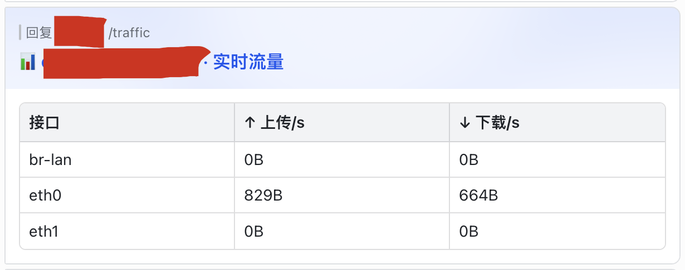
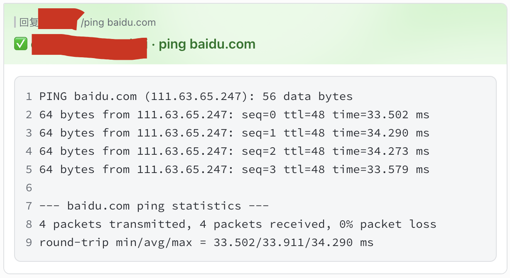
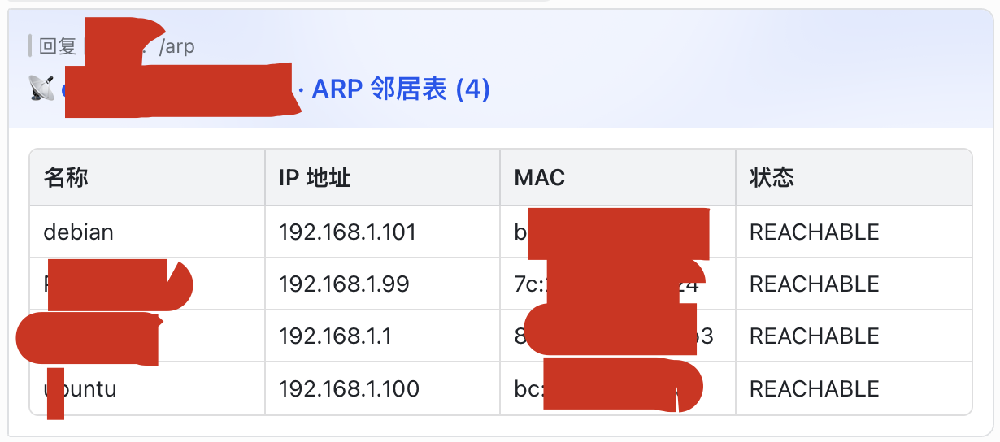
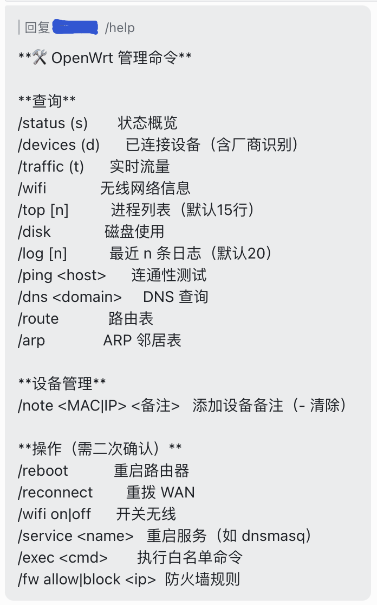

# larkwrt

一款轻量级 Go 代理程序，直接运行在 OpenWrt 路由器上，通过 WebSocket 长连接接入飞书（Lark）。它可以将路由器状态以交互卡片形式推送，在网络事件发生时触发告警，并接收来自指定群聊的管理员指令。

## 截图

| 状态卡片 | 实时流量 |
|---|---|
|  |  |

| Ping（实时输出） | ARP 邻居表 |
|---|---|
|  |  |



## 功能特性

- **状态监控** — CPU、内存、磁盘、负载、运行时长、温度
- **设备追踪** — 在线客户端，支持 MAC 厂商识别、DHCP 主机名、自定义备注
- **网络可视性** — 各接口实时流量、路由表、ARP 表、WiFi 信息
- **事件告警** — 新设备上线/离线、WAN IP 变化、CPU/内存过高、重启检测
- **远程命令** — ping、DNS 查询、日志追踪、进程列表、磁盘用量等
- **安全操作** — 重启、WAN 重连、WiFi 开关、服务重启、防火墙规则（全部需二次确认）
- **白名单执行** — 通过 `/exec` 执行可配置的白名单 shell 命令
- **速率限制** — 每个用户命令频率限制（默认 20 次/分钟）
- **多架构** — amd64、arm64、armv7、mips、mipsle（覆盖大多数 OpenWrt 硬件）

## 快速开始

### 1. 创建飞书应用

1. 前往 [飞书开放平台](https://open.feishu.cn/app) 创建一个新应用。
2. 在 **凭证与基础信息** 中，复制 `App ID` 和 `App Secret`。
3. 在 **功能 → 机器人** 中，启用机器人并将其添加到你的管理群聊。
4. 在 **权限与范围** 中，添加：
   - `im:message`（收发消息）
   - `im:message.group_at_msg`（接收群消息）
5. 发布应用版本。

### 2. 获取 chat_id 和管理员 open_id

- **chat_id**：在群聊中打开群设置，URL 中包含 chat ID，或使用飞书 API 查询群列表。
- **管理员 open_id**：用管理员账号向机器人发送一条消息；飞书事件回调中会包含你的 `open_id`（以 `ou_` 开头）。

### 3. 安装到 OpenWrt

将对应架构的二进制文件复制到 `/usr/bin/larkwrt-agent`，然后写入配置文件：

```sh
# 下载二进制文件（按需替换 VERSION 和 ARCH）
wget -O /usr/bin/larkwrt-agent \
  https://github.com/your-org/larkwrt/releases/download/VERSION/larkwrt-agent-ARCH
chmod 755 /usr/bin/larkwrt-agent

# 写入配置
mkdir -p /etc/larkwrt
cat > /etc/larkwrt/config.toml << 'EOF'
[feishu]
app_id     = "cli_xxxxxxxxxxxxxxxx"
app_secret = "xxxxxxxxxxxxxxxxxxxxxxxxxxxxxxxx"
chat_id    = "oc_xxxxxxxxxxxxxxxxxxxxxxxxxxxxxxxx"
admin_users = ["ou_xxxxxxxxxxxxxxxxxxxxxxxxxxxxxxxx"]

[router]
name = "Home Router"
EOF
chmod 600 /etc/larkwrt/config.toml

# 安装并启动服务
cp deploy/init.d/larkwrt /etc/init.d/larkwrt
chmod 755 /etc/init.d/larkwrt
/etc/init.d/larkwrt enable
/etc/init.d/larkwrt start

# 查看日志
logread -e larkwrt
```

或者使用一键安装脚本（需要将 `BINARY_URL` 指向实际发布地址）：

```sh
BINARY_URL=https://github.com/your-org/larkwrt/releases/download/v1.0.0 \
  sh deploy/install.sh \
    --app-id cli_xxx \
    --app-secret xxx \
    --chat-id oc_xxx \
    --admin ou_xxx \
    --admin ou_yyy \
    --name "Home Router"
```

## 配置参考

完整注释示例见 [`config.toml.example`](config.toml.example)。

| 配置段 | 键 | 默认值 | 说明 |
|---|---|---|---|
| `feishu` | `app_id` | — | 飞书 App ID（必填） |
| `feishu` | `app_secret` | — | 飞书 App Secret（必填） |
| `feishu` | `chat_id` | — | 目标群聊 ID，以 `oc_…` 开头（必填） |
| `feishu` | `admin_users` | — | 管理员 `open_id` 或 `user_id` 列表（必填） |
| `router` | `name` | `OpenWrt` | 卡片中展示的名称 |
| `router` | `lan_iface` | `br-lan` | 用于设备发现的 LAN 桥接接口 |
| `monitor` | `collect_interval_fast` | `5s` | CPU 与流量轮询间隔 |
| `monitor` | `collect_interval_slow` | `30s` | 设备列表与路由表轮询间隔 |
| `alert` | `cpu_threshold_pct` | `85` | CPU 告警阈值（%） |
| `alert` | `cpu_duration_secs` | `60` | CPU 持续超过阈值才告警（秒） |
| `alert` | `memory_threshold_pct` | `90` | 内存告警阈值（%） |
| `alert` | `cooldown_secs` | `300` | 同类告警最短间隔（秒） |
| `security` | `cmd_rate_limit` | `20` | 每用户每分钟最大命令数 |
| `security` | `exec_whitelist` | 见示例 | `/exec` 允许执行的命令白名单 |
| `devices` | `<MAC>` | — | 设备友好名称，例如 `"aa:bb:cc:dd:ee:ff" = "NAS"` |

## 命令

### 查询（只读）

| 命令 | 别名 | 说明 |
|---|---|---|
| `/status` | `/s` | 状态概览卡片 |
| `/devices` | `/d` | 已连接设备列表 |
| `/traffic` | `/t` | 实时接口流量 |
| `/wifi` | | 无线网络信息 |
| `/top [n]` | | Top 进程（默认 15） |
| `/disk` | | 磁盘用量 |
| `/log [n]` | | 最近 n 条日志（默认 20） |
| `/ping <host>` | | 连通性测试（实时输出） |
| `/dns <domain>` | | DNS 查询 |
| `/route` | | 路由表 |
| `/arp` | | ARP 邻居表 |
| `/note <MAC\|IP> <text>` | | 设置设备备注（`-` 表示清除） |
| `/help` | | 命令列表 |

### 操作（需二次确认）

| 命令 | 说明 |
|---|---|
| `/reboot` | 重启路由器 |
| `/reconnect` | 重新拨号 WAN |
| `/wifi on\|off [2.4\|5]` | 开关无线射频 |
| `/service <name>` | 重启白名单中的服务 |
| `/fw allow\|block <ip>` | 添加/删除 iptables 规则 |
| `/exec <cmd> [args…]` | 执行白名单中的 shell 命令（实时输出） |

## 从源码构建

环境要求：Go 1.21+，Docker（用于交叉编译）。

```sh
# 本地构建
go build -o larkwrt-agent ./cmd/agent

# 交叉编译全部架构（需要 Docker）
make all

# 运行测试
make test

# 运行测试并生成覆盖率报告
make coverage
```

## 架构

```
cmd/agent/main.go     入口；组装所有组件
internal/
  collector/          读取 /proc、/sys、ip、iwinfo；生成事件
  events/             带冷却去重的发布/订阅总线
  feishu/             WebSocket 长连接 + REST API + 卡片构建
  commands/           消息路由、速率限制、确认流程
  executor/           白名单强制的 shell 执行
  config/             TOML 配置加载与校验
deploy/
  init.d/larkwrt      OpenWrt procd 服务脚本
  install.sh          一键安装脚本
```

代理程序使用 WebSocket 长连接协议（而非 HTTP webhook）接入飞书。这意味着路由器主动外连；无需开放入站端口或调整防火墙规则。

## 安全说明

- 只有 `admin_users` 中列出的用户才能触发任何命令。
- 危险操作（重启、防火墙规则等）需在 60 秒内显式确认。
- Shell 命令通过 `exec.Command` 直接执行，不经过 shell 解释器 —— 元字符会被原样传递。
- `/exec` 命令受限于 `exec_whitelist`；白名单以外的二进制文件一律拒绝执行。
- 确保 `config.toml` 权限为 `600`（安装脚本会自动设置）。

## 故障排查

**代理无法启动**
```sh
logread -e larkwrt                                              # 查看启动错误
/usr/bin/larkwrt-agent -config /etc/larkwrt/config.toml        # 手动运行
```

**收不到消息**
- 确认 `app_id` / `app_secret` 正确。
- 确认机器人已被添加到群聊。
- 确认 `chat_id` 以 `oc_` 开头。
- 确保路由器能访问 `open.feishu.cn` 的 443 端口。

**指令被忽略**
- 确认你的飞书 `open_id` 已在 `admin_users` 中。
- 当代理拒绝你的消息时，调试日志中会打印你的 `open_id`。

**开启调试日志**
```sh
/usr/bin/larkwrt-agent -config /etc/larkwrt/config.toml -debug
```

## 许可证

MIT — 详见 [LICENSE](LICENSE)。
